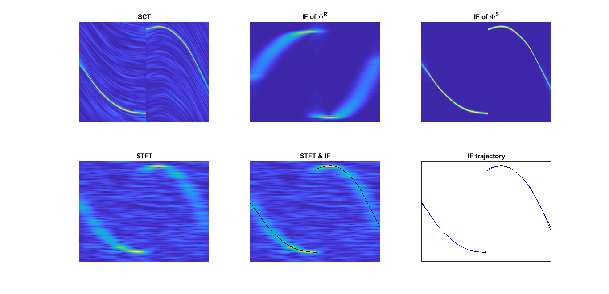
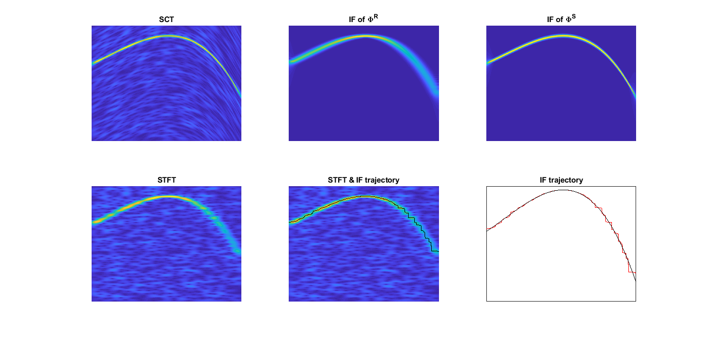
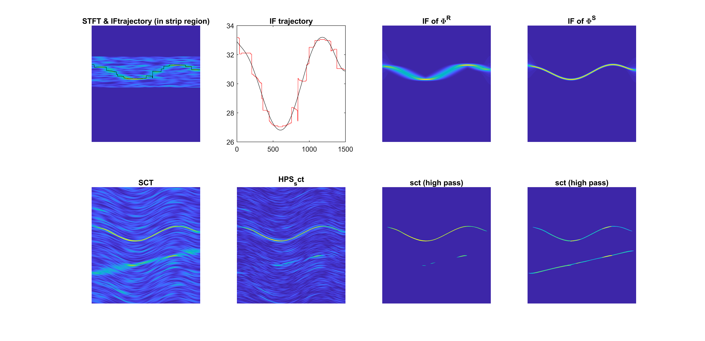

# SCT
## Spline-Kernelled Chirplet Transform
### Spline-Kernelled Chirplet Transform for the Analysis of Signals With Time-Varying Frequency

### Polynomial Chirplet Transform With Application to Instantaneous Frequency Estimation

### Multicomponent Signal Analysis Based on Polynomial Chirplet Transform

## References
* Y. Yang, Z. K. Peng, G. Meng and W. M. Zhang, "Spline-Kernelled Chirplet Transform for the Analysis of Signals With Time-Varying Frequency and Its Application," in IEEE Transactions on Industrial Electronics,
vol. 59, no. 3, pp. 1612-1621, March 2012, doi: 10.1109/TIE.2011.2163376.
https://ieeexplore.ieee.org/document/5971783
* Y. Yang, W. Zhang, Z. Peng and G. Meng, "Multicomponent Signal Analysis Based on Polynomial Chirplet Transform," in IEEE Transactions on Industrial Electronics, vol. 60, no. 9, pp. 3948-3956, Sept. 2013, doi: 10.1109/TIE.2012.2206331.
https://ieeexplore.ieee.org/document/6226868
* Z. K. Peng, G. Meng, F. L. Chu, Z. Q. Lang, W. M. Zhang and Y. Yang, "Polynomial Chirplet Transform With Application to Instantaneous Frequency Estimation," in IEEE Transactions on Instrumentation and Measurement, vol. 60, no. 9, pp. 3222-3229, Sept. 2011, doi: 10.1109/TIM.2011.2124770.
https://ieeexplore.ieee.org/document/5739524
* Bejvani, Mohammad, and Ali Gholami. "Seismic Signal Analysis Based on Spline-Kernelled Chirplet Transform."

